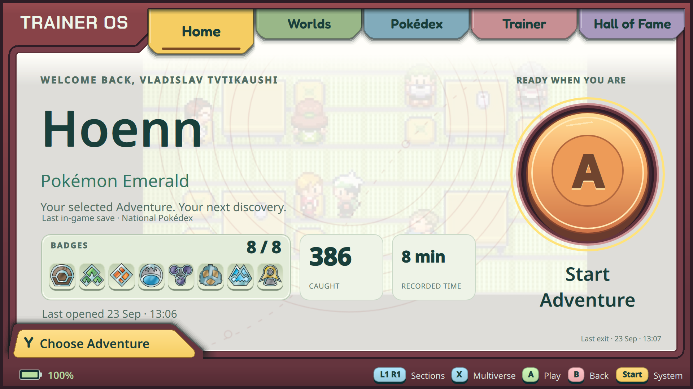
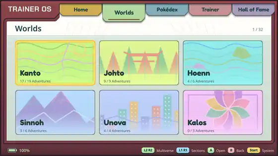
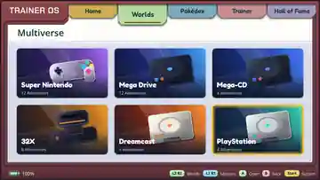
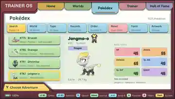
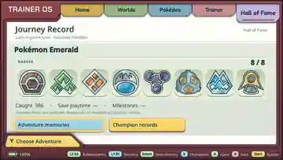

# TrainerOS

**A controller-first Linux handheld shell built around Adventures, Worlds, and a personal game history.**

TrainerOS started with a simple idea: a handheld should feel like a dedicated device, not a tiny desktop that happens to launch emulators. On the target Retroid Flip 2, TrainerOS is designed to be the main graphical session — power on, choose an Adventure, play, and return directly to the same interface when you are done.

Pokémon games are organized as **Worlds** and **Adventures** instead of ROM files and emulator cores. Non-Pokémon games live in the **Multiverse**, using the same controller-first shell and launch/return flow. Linux, ArmadaOS, emulators, save paths, and filesystem details stay underneath unless you deliberately enter maintenance mode.

> **Project status:** active development. TrainerOS is already installed and exercised as the main session on a real Flip 2 running ArmadaOS, but hardware support and game compatibility are still validated feature-by-feature rather than assumed.



## What it is

The normal experience is intentionally simple:

```text
Power on
   ↓
TrainerOS
   ↓
Choose an Adventure
   ↓
Play in RetroArch / melonDS / Dolphin / another verified adapter
   ↓
Exit the Adventure
   ↓
Return to the same TrainerOS context
```

TrainerOS is **not** a Linux distribution of its own, and it is not an Android launcher. It is a native C++/Qt shell and dedicated session that sits on top of an existing Linux handheld stack. The current target uses **ArmadaOS** for graphics, audio, input, packages, emulator runtimes, and recovery/maintenance.

| At a glance | |
| --- | --- |
| Target hardware | Retroid Flip 2 |
| Base system | ArmadaOS / Linux |
| Application stack | C++20, Qt 6 / QML, SDL2, SQLite, CMake |
| Input model | Controller-first; normal use does not require touch, mouse, or keyboard |
| Library format | Batocera-style ROM folders and `gamelist.xml` metadata/media |
| Development state | Working on real hardware, still evolving quickly |

## The interface today

TrainerOS has five peer sections switched with L1/R1. The UI keeps the same fixed handheld-style chassis while each section has its own job.

<table>
<tr>
<td width="50%"></td>
<td width="50%"></td>
</tr>
<tr>
<td align="center"><b>Worlds</b><br><sub>Pokémon Adventures organized by region.</sub></td>
<td align="center"><b>Multiverse</b><br><sub>Non-Pokémon games organized by platform.</sub></td>
</tr>
<tr>
<td width="50%"></td>
<td width="50%"></td>
</tr>
<tr>
<td align="center"><b>Pokédex</b><br><sub>Offline reference, search, filters, artwork and personal records.</sub></td>
<td align="center"><b>Hall of Fame</b><br><sub>Journey progress, memories and achievement views.</sub></td>
</tr>
</table>

### Home

Home is the current Trainer and Adventure at a glance. For explicitly verified Pokémon builds, TrainerOS can read ordinary save data and show real badge and Pokédex progress; it also tracks observed play sessions and can use the latest clean exit image as Adventure media. The large A action launches the selected Adventure normally rather than pretending a savestate is the game itself.

### Worlds

Pokémon is organized region-first: Kanto, Johto, Hoenn, Sinnoh, and the later regions are Worlds containing multiple Adventures, editions, remakes, and hacks. TrainerOS keeps stable Adventure identities even when display metadata or folders change. Current library tools support contextual rename, World reassignment, properties, deletion, and physical platform-folder moves where the operation can be proven safe.

### Multiverse

Multiverse is the same idea without forcing non-Pokémon games into the Pokémon model. Systems get their own visual cards and game wheels, while launch details stay behind adapters. Multiple RetroArch cartridge and CD routes plus melonDS and Dolphin have been exercised on the target device; support is deliberately recorded per route instead of claiming that every ROM or emulator combination works.

See [Multiverse runtimes](docs/MULTIVERSE_RUNTIMES.md), [disc support](docs/MULTIVERSE_DISCS.md), and [standalone adapters](docs/STANDALONE_ADAPTERS.md) for the current verified boundaries.

### Pokédex

The Pokédex is useful even without a running game: it has an offline reference database, search, combined filters, sorting, favorites, optional illustrations, and an animated companion layer. Current-save Seen/Caught data is only shown when TrainerOS has a verified provider for the exact game/build; unknown data stays unknown instead of being guessed.

Its paired Pokémon Center reads Emerald's Party and Storage, offers a living
Playroom, and can restore Party HP, status and move PP for the verified English
Emerald build. Treatment keeps a verified backup first and is loaded by the next
normal game launch. [Healing scope and recovery](docs/EMERALD_HEALING.md).

### Trainer and Hall of Fame

TrainerOS supports multiple local Trainer profiles with owner-scoped history and records. Optional controller-entered PINs and a family recovery code are available for shared handhelds. The first per-Trainer ordinary-save namespace is implemented for the verified GBA/mGBA route; other emulator save paths stay shared until they are individually validated.

Hall of Fame keeps manual Adventure memories separate from save-derived progress and RetroAchievements. Journey currently reuses verified progress where it exists, while richer Champion snapshots and additional exact-save projections remain future work.

## Library, artwork, and video

TrainerOS follows Batocera's filesystem and `gamelist.xml` conventions instead of inventing a private ROM manifest:

```text
Emulation/
  bios/
  roms/
    gba/
      Pokemon - Emerald Version (USA, Europe).gba
      gamelist.xml
      images/
      videos/
    snes/
    psx/
    gamecube/
    ...
```

The default library root is `~/Emulation/roms` and can be overridden with `--roms-dir`. Folder discovery runs off the UI thread. Existing `gamelist.xml` metadata and media are read without importing external favorites/play counts as TrainerOS history, and a normal library scan does **not** make network requests.

Game views understand cover art, screenshots, logos/wheels, fanart, titleshots, and other Batocera media references. Local `<video>` previews are also supported in Worlds and Multiverse: after selection settles, a single muted player loops the local clip and releases it when the page is hidden, a menu opens, or an Adventure launches. Video previews can be disabled in **Settings → Media** and always fall back to still artwork if decoding is unavailable.

User ROMs, saves, BIOS files, credentials, and private media stay outside this repository. For the exact folder/media contract, see [Batocera library and game media](docs/BATOCERA_LIBRARY.md) and [local video previews](docs/VIDEO_PREVIEWS.md).

## ScreenScraper integration

Native **ScreenScraper WebAPI** support is the current top-priority integration: [issue #65](https://github.com/EriArk/TrainerOS/issues/65) / [implementation notes](docs/SCREENSCRAPER.md).

The backend groundwork is already in the tree: an explicit platform map for the systems currently discovered by TrainerOS, streaming MD5/SHA1/CRC32/size fingerprinting, a bounded WebAPI v2 client with quota pacing and credential handling, exact-match validation, and an atomic Batocera media/`gamelist.xml` writer that preserves unrelated fields. The pieces are covered by injectable/fake-transport tests so ordinary library scans remain completely offline.

What is **not** delivered yet is the live end-user scraping flow: developer credentials and authenticated service proof, persistent identity/download cache, archive/disc matching policy, cancellable job queue, ambiguous-result selection, controller actions for game/system/library scraping, and the final rescan handoff. In other words: the plumbing is prepared, but TrainerOS does not yet present ScreenScraper as a finished user feature.

## Launch, exit, and the dedicated session

TrainerOS owns the normal handheld flow instead of dropping the user back into a desktop between games. The installed session uses Gamescope and a small supervisor/recovery layer on top of ArmadaOS. Supported Adventures launch through narrow adapters, and the shell restores the previous page/focus after the child process exits.

The current exit path can capture the running game before showing a compact controller confirmation. Cancelling keeps the game alive; confirming performs the validated close/save policy and returns to TrainerOS. Clean exit media is stored separately from crashes and incomplete sessions.

Start also exposes quick volume/brightness controls, Power actions, Trainer switching, settings, and device diagnostics. Battery status stays in the fixed lower chassis. Plasma remains available as an explicit maintenance/recovery environment.

See [Adventure exit](docs/ADVENTURE_EXIT.md), [session integration](docs/SESSION_PROTOTYPE.md), and [device controls](docs/DEVICE_CONTROLS.md).

## Build and try it

TrainerOS is a native Qt application. The current development baseline requires CMake 3.24+, a C++20 compiler, Qt 6.4+ (`Core`, `Gui`, `Qml`, `Quick`, `Sql`, `Network`, `Xml`, `Multimedia`), SDL2, OpenSSL 3, and the Qt SQLite driver. The video-preview test also uses `ffmpeg` to generate an original local fixture.

A normal Linux development build looks like this:

```sh
git clone https://github.com/EriArk/TrainerOS.git
cd TrainerOS

cmake -S . -B build/native -G Ninja -DCMAKE_BUILD_TYPE=Debug
cmake --build build/native --parallel
ctest --test-dir build/native --output-on-failure

# Safe desktop preview with sample data:
./build/native/traineros --windowed --ephemeral
```

`--ephemeral` is the easiest way to explore the interface without touching a personal database or requiring a ROM library. Running without it uses persistent local TrainerOS data. The dedicated ArmadaOS session should only be installed after reading the device/session documentation and keeping a working maintenance path.

For package examples, Windows development notes, test scenarios, and device setup, see [docs/DEVELOPMENT.md](docs/DEVELOPMENT.md).

## Architecture

The project keeps presentation, personal data, emulator quirks, and platform behavior separate on purpose:

```text
QML / Qt Quick presentation
          ↓
feature controllers + domain/repository interfaces
          ↓
SQLite / library / history / progress services
          ↓
Adventure adapters + platform services
          ↓
RetroArch / melonDS / Dolphin / ArmadaOS / Linux
```

QML does not parse saves, run shell commands, or talk directly to SQLite. Slow filesystem, database, hashing, and network work belongs on worker/service boundaries so controller navigation stays responsive.

The deeper design is documented in [Architecture](docs/ARCHITECTURE.md), [Product spec](docs/PRODUCT_SPEC.md), and [UX/navigation](docs/UX_NAVIGATION.md).

## Current direction

The immediate sequence is:

1. finish the authenticated ScreenScraper job/controller integration and live service validation;
2. complete richer game metadata and description presentation around the existing artwork/video layer;
3. continue the Pokédex → Party/Storage → Pokémon Center chain using only verified save providers;
4. continue runtime/platform/recovery work and the final generic artwork-pack tooling afterwards.

The roadmap is deliberately evidence-driven: a successful process start or a known file format is not treated as proof that a platform, save format, or destructive write is safe. Device checks and exact-build gates stay visible instead of being hand-waved away.

See the continuously updated [ROADMAP](docs/ROADMAP.md) for delivered increments, remaining gates, and the current execution order.

## Repository map

| Path | Purpose |
| --- | --- |
| `src/` | C++ application, feature controllers, adapters, platform services, and QML |
| `tests/` | Native, integration, persistence, and rendered controller scenarios |
| `data/` | Bundled reference/catalogue data that is safe to distribute |
| `assets/` | Original/licensed UI assets and attribution files |
| `packaging/` | Linux desktop/session and maintenance integration |
| `docs/` | Product contracts, architecture, feature evidence, and roadmap |
| `AGENTS.md` | Working contract for coding agents used on the project |

## Content and project boundaries

TrainerOS does not ship ROMs, BIOS/firmware dumps, encryption keys, commercial saves, or ripped proprietary game assets. Personal game files and credentials belong to the local installation, not the repository.

TrainerOS is an unofficial fan-made project. It is not affiliated with Nintendo, The Pokémon Company, Retroid, ScreenScraper, Libretro, or the emulator projects it can integrate with. Their names and trademarks belong to their respective owners.

The repository is public, but **no software license has been selected yet**. Until a license file is added, normal copyright rules apply to the source code.

---

The long-term goal is pretty simple: opening the handheld should feel like powering on **your own trainer terminal**, with years of Adventures, saves, discoveries, and memories inside it — while Linux quietly does the boring work underneath.
