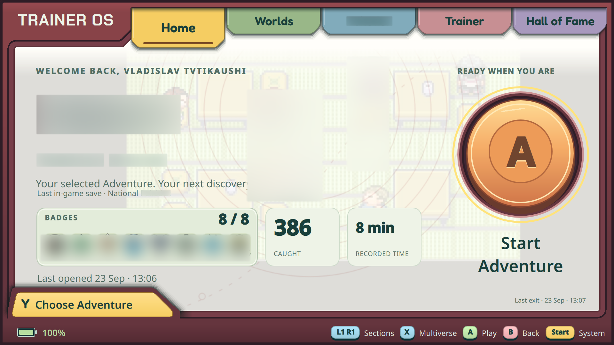
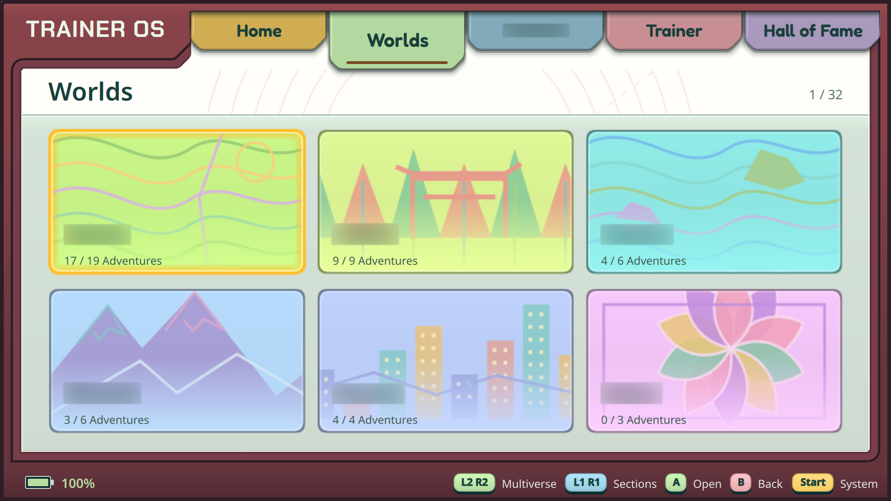
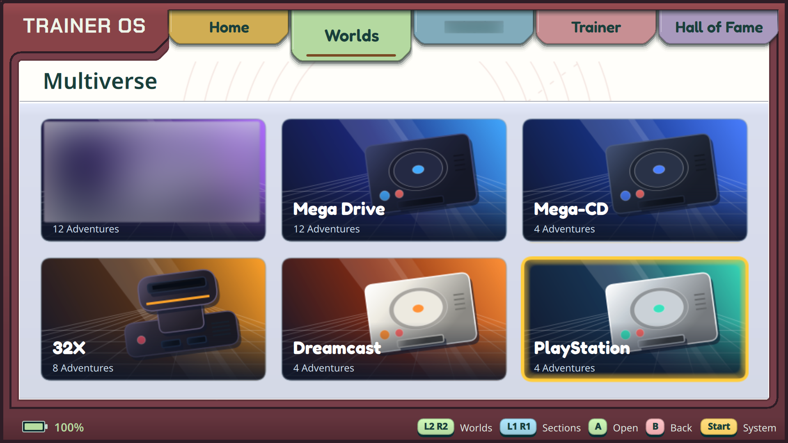
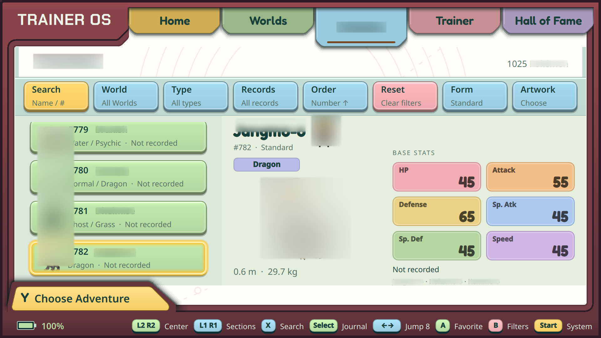
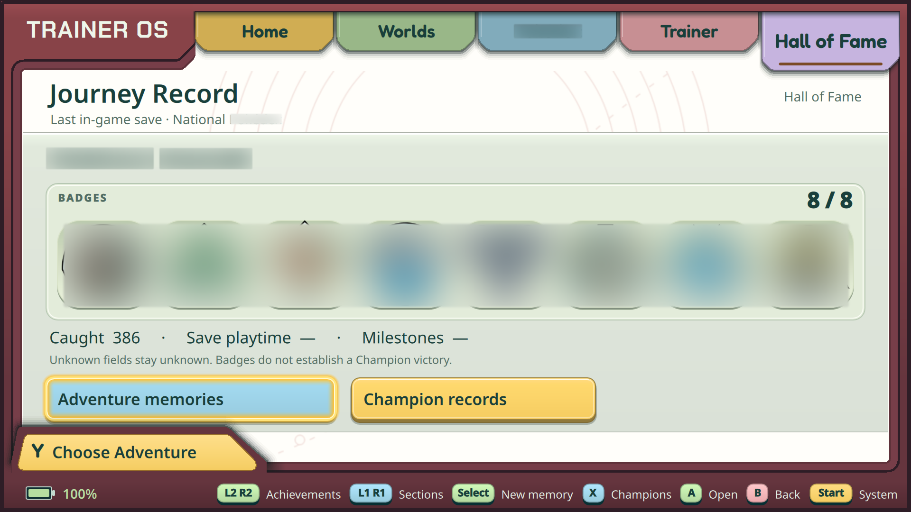

# TrainerOS

TrainerOS is a controller-first handheld shell for Linux/ArmadaOS.

The idea is simple: **a game should not completely disappear when you exit it.**

TrainerOS launches ordinary games through ordinary emulators, but supported games can also leave part of themselves in the system: your progress, characters, collections, history and safe game-specific actions.

Pokémon is the first game family where that idea goes deep.

## What this looks like

With a verified Pokémon Emerald save, TrainerOS already knows the actual team in that save.

The same six Pokémon can appear on Home, in Party, in Boxes and in the Playroom. The Field Guide shows real Seen/Caught progress. Journey shows real badges, milestones and Champion history.

The connection also works in the other direction.

TrainerOS can safely change supported parts of the real save:

- heal HP, status and PP
- buy items, decorations and services with real in-game currencies
- move Pokémon between Party and Boxes
- swap occupied slots
- release Pokémon with safeguards
- manage held items
- rename Boxes
- use protected backup/restore around save changes

Launch Emerald afterwards and the game itself sees those changes.

That is the core of TrainerOS: **the game remains the game, but some of its world continues into the handheld around it.**

## The everyday loop

~~~text
Boot TrainerOS
   ↓
Choose an Adventure
   ↓
Play the actual game
   ↓
Press Home
   ↓
Continue in the same running game
or choose Exit game → confirm saving when required
   ↓
Return to TrainerOS
   ↓
Game-aware screens refresh from the real save
~~~

TrainerOS does not use emulator savestates as its normal product model. Games boot normally and keep their own ordinary saves.

Short **A** on a playable game launches it directly. Linux paths, emulator cores and setup details stay out of normal browsing whenever TrainerOS can resolve them itself.

## Companions

The Pokémon-facing part of the shell is currently the deepest game-aware experience.

Its main views are arranged as peers instead of nested menus:

**Guide ⇄ Party ⇄ Boxes ⇄ Care Center ⇄ Playroom ⇄ Shops**

The current Adventure is shared across them.

The shell itself stays simple:

**Home ⇄ Worlds ⇄ Companions ⇄ Trainer ⇄ Social**

Trainer contains **Profile ⇄ Journey ⇄ Hall ⇄ RetroAchievements** as full peer
views. Social has Friends and Chats faces; its external account/messaging
provider is the next integration and the current surface is honestly unlinked.
Existing history, profiles and achievements remain available offline.

L1/R1 changes the main section. L2/R2 changes the current section's faces.

## Two handhelds can meet

TrainerOS now runs on both a **Retroid Flip 2** and an **AYN Odin 2**.

The two devices have already completed real Emerald interactions through TrainerOS:

- protected Pokémon trades
- gifts
- Pokémon sales using in-game money
- native Gen III trade evolutions
- full-team local battles
- voluntary and forced switching
- Bag medicine during battles
- optional money or Pokémon stakes
- reconnectable durable save transactions

A traded Pokémon is written into the real receiving save. Ordinary Emerald on the receiving console can load it normally.

The Link transaction is deliberately conservative: both sides prepare protected changes, commit through durable journals and keep unresolved work blocked until both devices agree on the final result.

Nearby Play advertises the active Trainer and uses invitation popovers. Bluetooth is the default route between nearby consoles without a router; ordinary LAN is an independent alternative. Flip 2 ↔ Odin 2 has completed a protected Emerald exchange and a full-team battle with money stakes and medicine over Bluetooth. Wi-Fi Direct is deferred. Broader radio compatibility, long-duration reliability and the earlier Odin freeze cause remain open.

[Emerald Link details and evidence](docs/EMERALD_LINK.md) · [Nearby Play](docs/NEARBY_PLAY.md)

## One Trainer, many Adventures

A **Trainer** is separate from an individual game.

Multiple local Trainers already have their own profiles, optional PINs, TrainerOS history and isolated state. GBA/mGBA also has a verified per-Trainer ordinary-save route.

Pokémon Adventures are organized by **Worlds** such as Kanto, Johto and Hoenn instead of by emulator folder.

Journey keeps the longer history: current progress, milestones and preserved Champion records can outlive the exact moment represented by the current save.

## Multiverse

TrainerOS is not limited to Pokémon.

Everything without a dedicated game-family experience currently lives in the **Multiverse**.

The Multiverse already has:

- a persistent Batocera-style library
- artwork, metadata and local video previews
- direct one-button launch
- launch/return history
- verified RetroArch and standalone emulator routes
- guarded Home exit for supported runtimes

The longer-term direction is to split large series into their own first-class packs, similar to Pokémon: for example **Final Fantasy**, **Metal Slug**, **Need for Speed**, **Sonic** and other series with enough games and enough useful shared concepts.

Games without such a pack simply remain in the generic Multiverse.

## Game adapters

Deep integrations are exact-game work, not guesses based on console or generation.

TrainerOS keeps a game-adapter knowledge base with exact build identities, capabilities, research evidence and validation state.

The current Gen III implementation has also been exported as a standalone portable source copy that builds independently from the TrainerOS application. It is not yet a final plugin ABI, but it is the first practical step toward separately installable game adapters.

A game may support only launch/history, or it may eventually expose much more. Read support never automatically implies write support.

[Game-adapter knowledge base](docs/adapters/README.md)

## Real hardware

TrainerOS is actively exercised on two ArmadaOS handhelds:

### Retroid Flip 2

The original/reference development device.

### AYN Odin 2

The second real hardware target, with its own 1920×1080 TrainerOS Gamescope session and controller profile.

On Odin 2, TrainerOS reuses the existing ArmadaOS emulator and Steam environment instead of replacing it. Verified device work includes PSP through PPSSPP, PS2 through the existing ARMSX2 installation, Pokémon/RetroArch routes, controller-driven network settings and guarded launch/return flows.

[Odin 2 bring-up](docs/ODIN2_BRINGUP.md)

## First run and normal system use

TrainerOS is being built to behave like the handheld's everyday interface rather than an app launched from a desktop.

The current first-run flow already covers:

~~~text
Welcome
→ controls
→ optional Wi-Fi / Bluetooth
→ date and time
→ library storage
→ Trainer profile
→ optional PIN
→ Home
~~~

It is controller-driven, resumable and can continue offline.

Settings now handles normal device tasks such as connections, display/audio controls, storage and accounts without requiring a desktop for everyday use. Plasma remains available as an explicit maintenance/recovery environment, and Steam remains installed.

## What already works

TrainerOS is still under active development. Current working pieces include:

- dedicated TrainerOS sessions on Flip 2 and Odin 2
- controller-only shell navigation and text entry
- resumable first-run setup
- Wi-Fi and Bluetooth management
- multiple local Trainers
- Batocera-style ROM discovery and media
- direct one-button game launch
- RetroArch, melonDS, Dolphin, PPSSPP and selected standalone routes
- guarded Home exit/cancel/return
- save-backed Emerald Guide, Party, Boxes and Journey
- protected Emerald healing, shops and Party/Box management
- Playroom and read-only Practice Battle
- two-device Emerald trading, gifting, selling and full-team battles
- signed local history for protected save changes
- RetroAchievements account integration and launch handoff
- portable exact-game adapter evidence/source snapshots

Support is intentionally verified game-by-game and runtime-by-runtime. Similar titles do not silently inherit write capabilities.

<table>
<tr>
<td width="50%"></td>
<td width="50%"></td>
</tr>
</table>

## Library

TrainerOS follows Batocera-style folders and gamelist.xml rather than inventing a private ROM format.

~~~text
Emulation/
  bios/
  roms/
    gba/
    nds/
    ps2/
    psp/
    gamecube/
    ...
~~~

Drop a game into a prepared platform folder and TrainerOS can discover it. Existing metadata and media stay useful.

## Where it is going

The intended public form is a reproducible **TrainerOS image based on ArmadaOS** with first-run setup, OTA updates, rollback and portable Trainer recovery.

Other major directions already tracked in the project include:

- separately installable game adapters
- franchise packs beyond Pokémon
- stronger save/session provenance for trust-sensitive play
- Steam games inside Multiverse
- more handheld device profiles
- final user-created artwork/sprite packs
- late-stage local extraction of fallback visuals from the user's own game content

The current working artwork remains in development use; the final distribution is not intended to ship commercial ROMs or game artwork.

## Development

TrainerOS is native **C++20 + Qt 6/QML** with SDL2, SQLite and CMake.

~~~sh
git clone https://github.com/EriArk/TrainerOS.git
cd TrainerOS

cmake -S . -B build/native -G Ninja -DCMAKE_BUILD_TYPE=Debug
cmake --build build/native --parallel
ctest --test-dir build/native --output-on-failure

./build/native/traineros --windowed --ephemeral
~~~

Useful project docs:

- [Roadmap](docs/ROADMAP.md)
- [Navigation migration](docs/NAVIGATION_111.md)
- [Social/Home acceptance](docs/EXPANSION_98_112.md)
- [Odin 2 bring-up](docs/ODIN2_BRINGUP.md)
- [Game-adapter knowledge](docs/adapters/README.md)
- [Emerald Link](docs/EMERALD_LINK.md)
- [Architecture](docs/ARCHITECTURE.md)
- [Batocera library](docs/BATOCERA_LIBRARY.md)

TrainerOS does not ship ROMs, BIOS files, commercial saves or private ripped media.

TrainerOS is an unofficial fan-made project and is not affiliated with Nintendo, The Pokémon Company, Retroid, AYN, ArmadaOS, Valve, ScreenScraper, RetroAchievements, Libretro or the emulator projects it can integrate with.

No software license has been selected yet.
