# TrainerOS

**A controller-first handheld system built around your games, your progress and the people you play with — not emulator menus.**

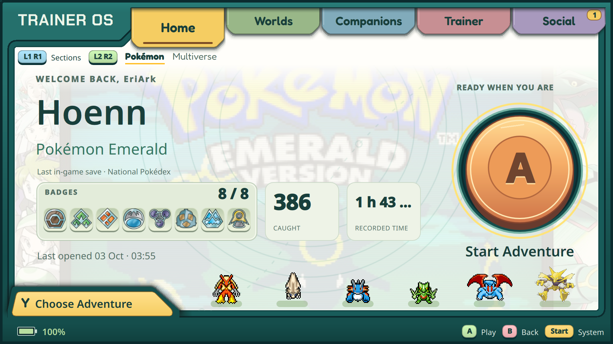

TrainerOS is the interface you boot into, browse your library from, talk to friends in, launch games from and come back to when you are done.

For an ordinary game, that can be as simple as **pick it → press A → play → press Home → return**.

For games TrainerOS understands more deeply, the boundary starts to disappear. Your party, progress, collections and history can live in the system around the game. Friends can see that you are playing, ask to join, and enter a supported multiplayer game without opening an emulator lobby or typing an IP address.

Pokémon is the first game family where TrainerOS goes much further than a launcher. Everything else has a home in the **Multiverse**.

TrainerOS is still in active development, but the current build already runs as a dedicated handheld session on **Retroid Pocket Flip 2** and **AYN Odin 2**.

[Full-resolution screenshots from the current handheld build](screenshots/site-2026-10-04/README.md)

## Pick a game and play

Pokémon games are organized as **Worlds**. Everything else lives in the **Multiverse**.

<table>
<tr>
<td width="50%">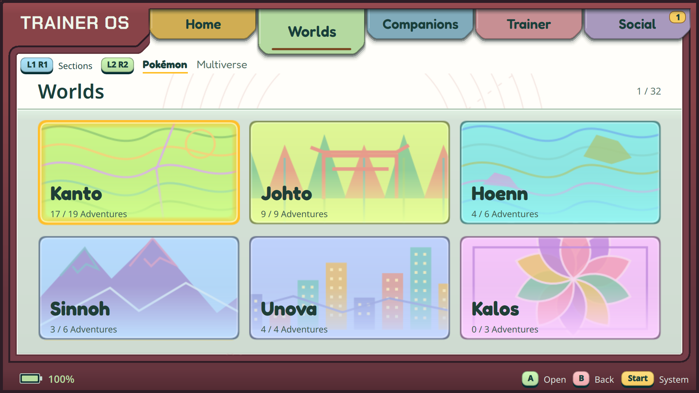</td>
<td width="50%">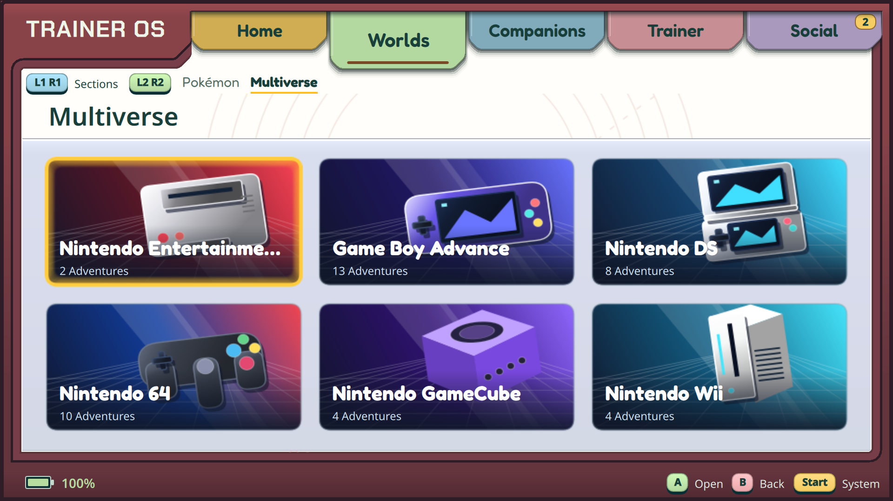</td>
</tr>
</table>

There is no normal setup screen between the library and the game. If a game is ready, **A launches it**.

TrainerOS keeps emulator paths, cores, command lines and room settings out of the everyday interface. Press Home while playing and you get a small game-aware menu over the running game: continue, invite someone when multiplayer is available, or exit cleanly back to TrainerOS.

Your ordinary game save stays the ordinary game save. TrainerOS does not make savestates the center of the experience.

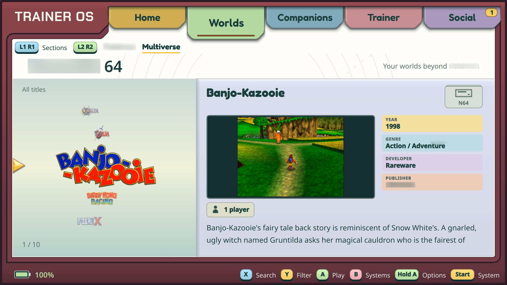

The general library can use Batocera-style folders and existing metadata, artwork and local video previews. Player-count information can be shown where it is known, and games with supported multiplayer can expose it directly from the library instead of making you remember which emulator happens to support what.

## Chat, invite, play

**Social is built into TrainerOS.** It is not a link that throws you into another app.

Messages, groups, communities and discovery live alongside Home, Worlds, Companions and Trainer. You can read and send messages with the controller, keep conversation history, manage friends and groups, receive image attachments and use voice calls without leaving the shell.

<table>
<tr>
<td width="50%">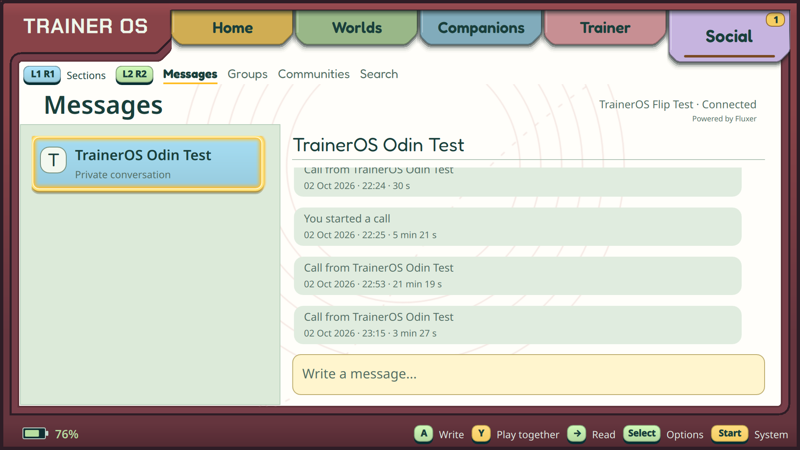</td>
<td width="50%">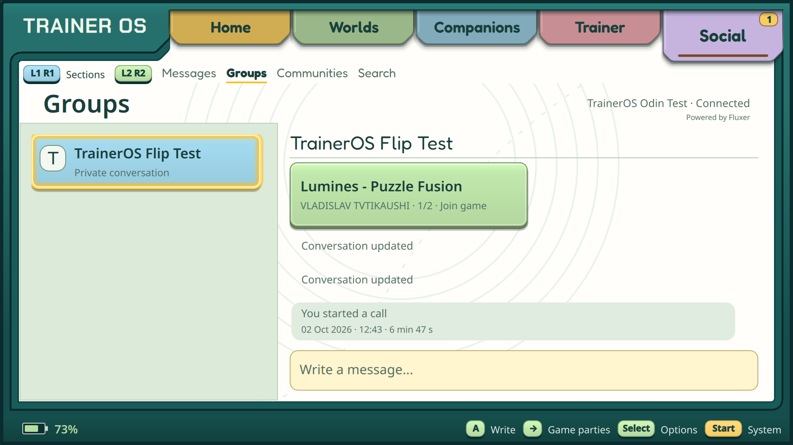</td>
</tr>
</table>

And the chat actually knows about games.

If a friend is playing a compatible game, their game can appear **above the conversation**. Press **Y · Ask to join**. They get Accept / Decline in Home. Once accepted, the party appears with its available seats and the organizer presses **Start game**.

TrainerOS handles the rest underneath. No copying IP addresses. No emulator room browser. No asking your friend which core they launched.

You can also go the other way: while playing, open Home → **Invite friend** → choose Nearby or Online friend → pick a person or group.

If you leave a supported match while the host keeps playing, the conversation can show the open place again so you can **Join game** and return to the same running host. Groups can keep their chat and membership while different game parties start and end inside them. Selected members can be allowed to join your games without making you approve the same person every time.

A group voice call is separate from a particular match, so the same friends can keep talking while somebody changes games, leaves a party or joins another one.

Real paired gameplay has already been exercised on handhelds with classic NES, Mega Drive and SNES games, PSP Lumines and GameCube Melee. Some supported games can prepare three or four player seats as well. Compatibility is still being expanded and verified game by game; TrainerOS does not label every multiplayer ROM as online-capable just because an emulator can launch it.

## Pokémon can live outside the game

Pokémon is where the main TrainerOS idea becomes most obvious.

With a supported Emerald save, the Pokémon you see in TrainerOS are the Pokémon that are actually in the game.

<table>
<tr>
<td width="50%">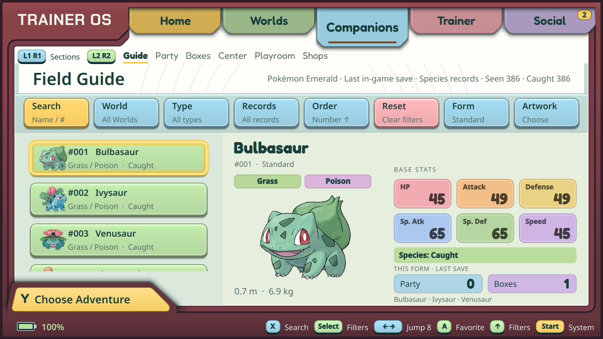</td>
<td width="50%">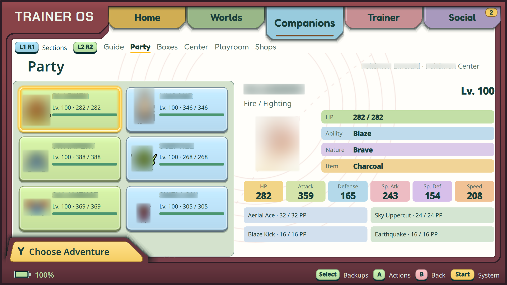</td>
</tr>
</table>

The **Field Guide** can show real Seen/Caught progress. **Party** shows the actual six Pokémon. **Boxes** reads the real storage. **Journey** can follow real badges and milestones.

The connection also works in the other direction.

From TrainerOS, supported Emerald saves can already be healed, Pokémon can be moved between Party and Boxes, occupied slots can be swapped, held items can be managed, Boxes can be renamed, and protected releases can be performed. Shops and services can spend the game's real currencies and put the purchased result into the real save.

Launch Emerald afterwards and the game sees the change.

<table>
<tr>
<td width="50%">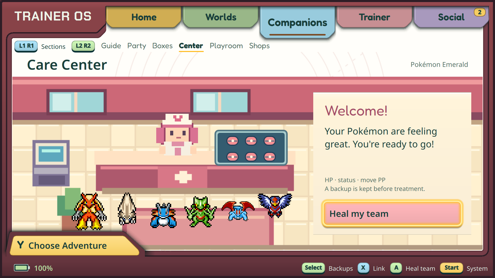</td>
<td width="50%">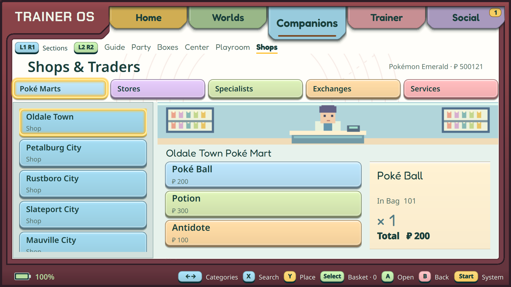</td>
</tr>
</table>

The **Playroom** is deliberately less practical. It gives the real current party somewhere to exist on the handheld outside battles — moving around, reacting and simply being present instead of turning every Pokémon screen into another spreadsheet.

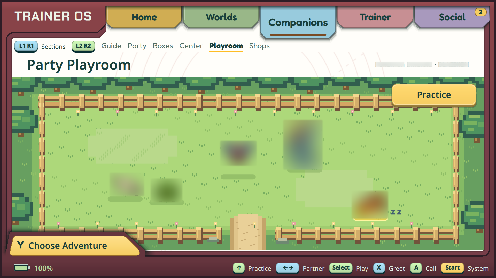

TrainerOS also has its own **Link** activities. Two nearby TrainerOS handhelds have already completed protected Emerald trades, gifts, Pokémon sales, native trade evolutions and full-team battles using the real saves. That is separate from ordinary emulator multiplayer: persistent Pokémon moving between two Trainers needs its own safeguards and recovery.

## One Trainer across many games

A **Trainer** belongs to the person using the handheld, not to one ROM.

Multiple local Trainers can have their own profiles, optional PINs, history, navigation state and accounts while sharing the same installed game library. The first isolated ordinary-save route is already working for GBA/mGBA, with more runtimes planned to follow.

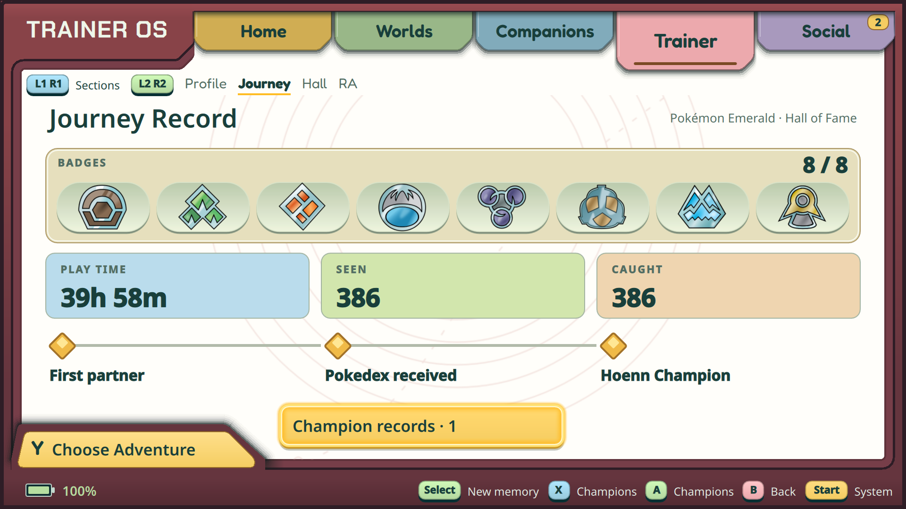

**Journey** keeps the larger story: current progress, milestones and eventually the pieces worth remembering after a particular save has moved on. Hall records and RetroAchievements remain their own sources instead of being mixed together into invented progress.

The intended end state is that your Trainer can survive the device too: export it, restore it after a reflash, or move it to another supported TrainerOS handheld without treating the whole system as disposable.

## Not every game needs to become Pokémon

The **Multiverse** is a full part of TrainerOS, not a waiting room for games that do not have special integration.

A game can simply have a good cover, video preview, play history, direct launch, Home menu and clean return. That is enough.

Larger series can eventually get their own first-class experience when there is something meaningful to build around them: a Sonic, Final Fantasy, Metal Slug or Need for Speed section should use concepts that fit those games rather than borrowing Party and Pokédex because TrainerOS happens to have them.

Installed Steam games are intended to join the Multiverse in the same way. Steam itself remains available for the things Steam is good at; TrainerOS only needs to make the installed games feel like part of the same handheld.

## It behaves like the device, not an app on the device

The main navigation stays small:

**Home ⇄ Worlds ⇄ Companions ⇄ Trainer ⇄ Social**

L1/R1 moves between those spaces. L2/R2 moves between related views inside them.

Companions contains **Field Guide ⇄ Party ⇄ Boxes ⇄ Care Center ⇄ Playroom ⇄ Shops**.

Trainer contains **Profile ⇄ Journey ⇄ Hall ⇄ RetroAchievements**.

Social contains **Messages ⇄ Groups ⇄ Communities ⇄ Search**.

First run already walks through controls, optional Wi-Fi/Bluetooth, date and time, game storage, Trainer creation and an optional PIN. It can continue offline and resume if setup is interrupted.

<table>
<tr>
<td width="50%">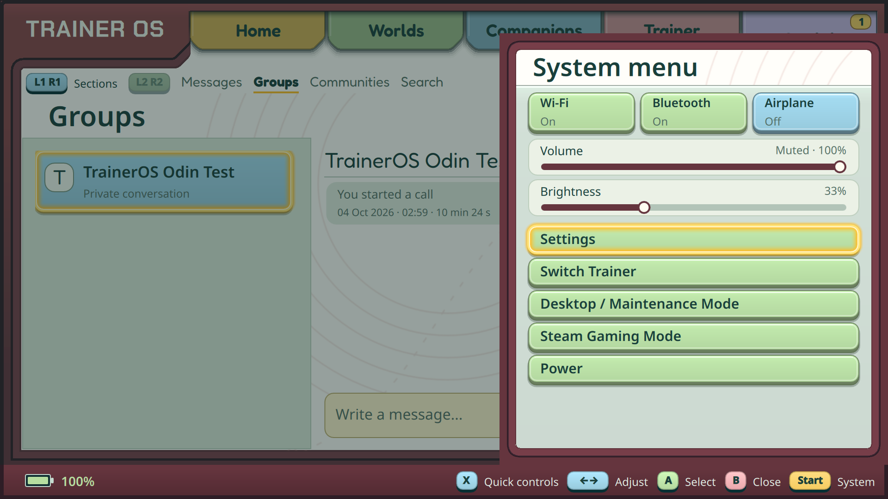</td>
<td width="50%">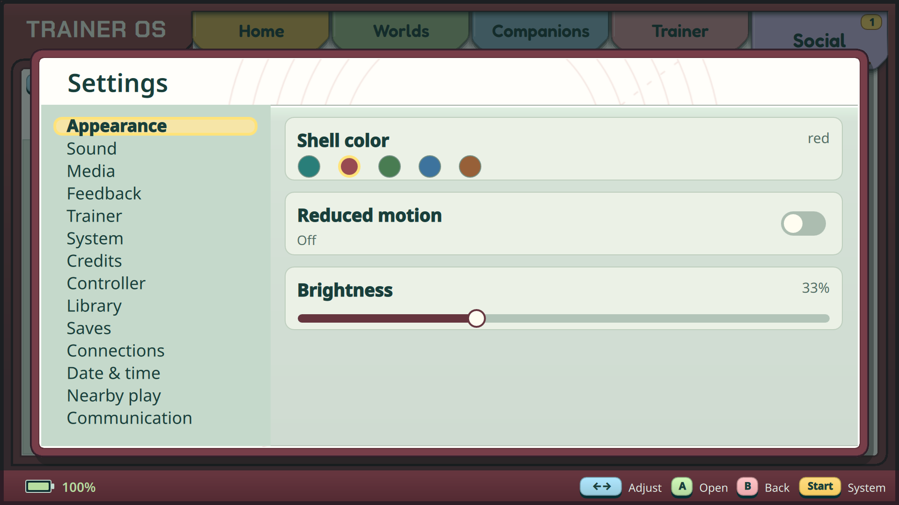</td>
</tr>
</table>

Start opens the small system menu. Settings handles the things you normally expect from the handheld itself: connections, display and audio, storage, accounts and communication settings. Plasma stays available as an explicit maintenance/recovery environment, and Steam remains installed.

The point is not to remove Linux. The point is that you should not have to use a Linux desktop just to use your game console.

## Where it is going

The public form of TrainerOS is intended to be a **ready-to-use ArmadaOS-based system image** for supported handhelds, not a weekend of manually installing a frontend and configuring a dozen emulators.

On first boot: choose the basics, point TrainerOS at internal or removable game storage, create your Trainer and start using the device. Supported emulator setups belong in the image. Your ROMs, firmware, saves and personal media remain yours.

The remaining big pieces are the boring-but-important ones that turn the current development handhelds into something other people can safely live with: reproducible images, staged updates with rollback, portable Trainer backup/restore, wider handheld support, more verified multiplayer routes, more game families and final user-installable artwork.

What already exists is deliberately kept separate from what is merely planned. TrainerOS may know that a game launches without claiming it understands the save. It may know that a game has four players without claiming four real TrainerOS users have completed a session. Unsupported things stay unsupported instead of becoming optimistic buttons.

For the current implementation status and the long version of what remains, see the [Roadmap](docs/ROADMAP.md). For the much nerdier development evidence, the [project docs](https://github.com/EriArk/TrainerOS/tree/main/docs) are there on purpose so this README does not have to become one.

---

TrainerOS does not ship commercial ROMs, BIOS files, commercial saves or private ripped media.

TrainerOS is an unofficial fan-made project and is not affiliated with Nintendo, The Pokémon Company, Retroid, AYN, ArmadaOS, Valve, Fluxer, ScreenScraper, RetroAchievements, Libretro or the emulator projects it can work with.

No software license has been selected yet.
