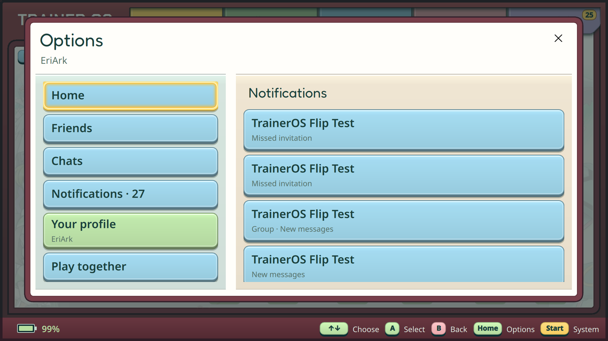
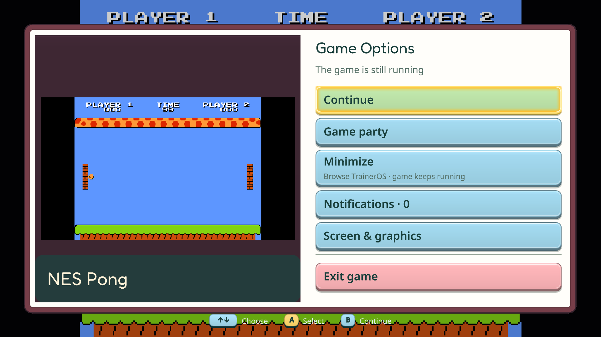
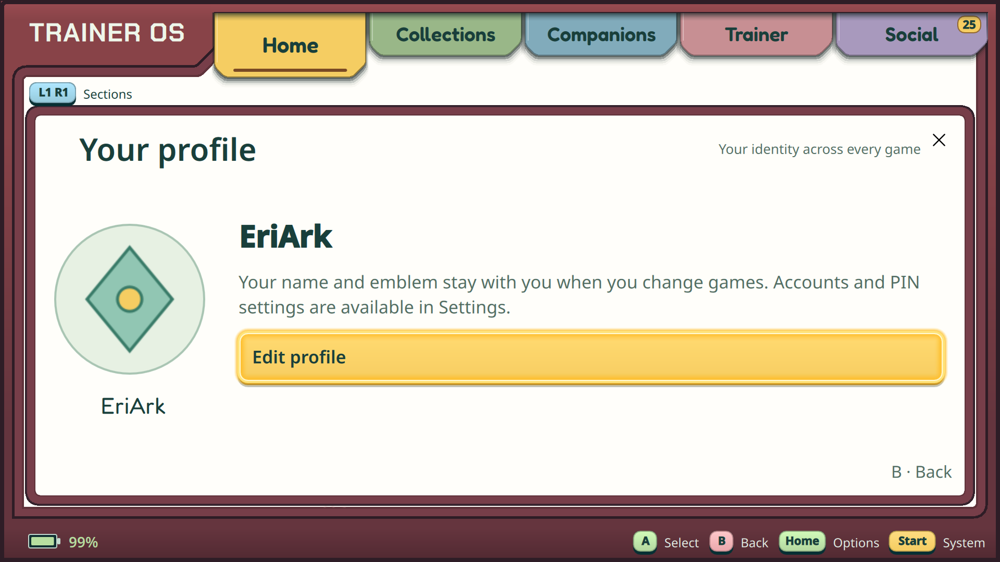
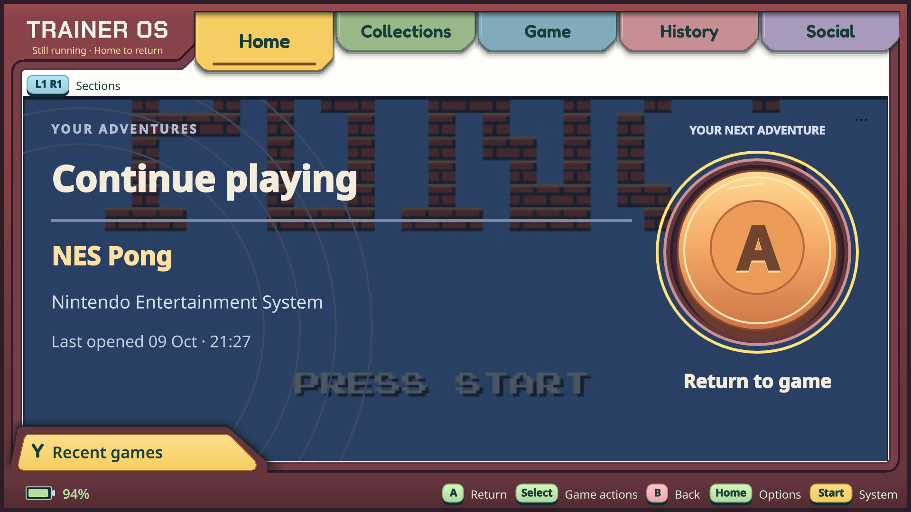
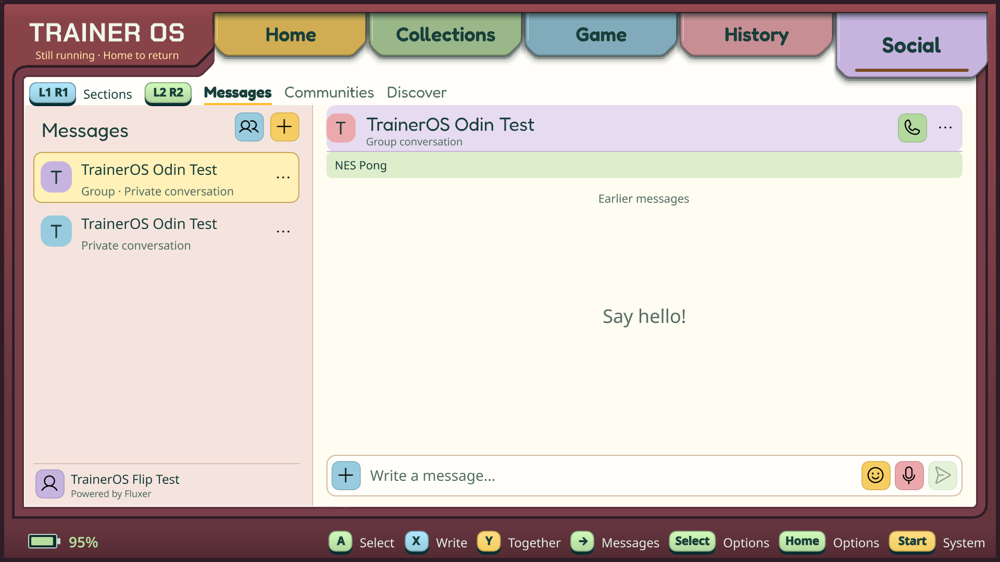
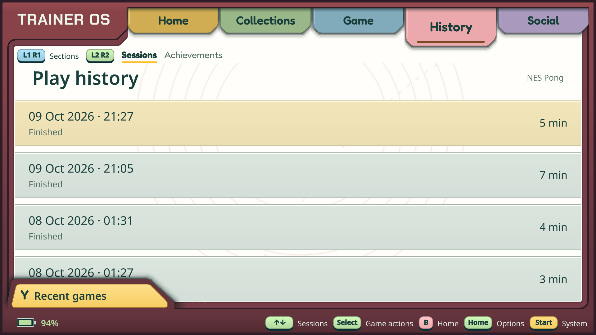

# UX-02 framework and controls

Implemented and installed, 9 October 2026. This record supplements the accepted
[interaction map](UX_OPTIONS_MAP_RU.md) and [experience register](EXPANSION_174_178.md).
The evidence below distinguishes installed behavior from retained external acceptance.

## Implemented behavior

- Five stable navigation slots remain. Selected Home Adventure supplies Home,
  two contextual slot labels and trusted built-in views. Pokemon uses its existing
  Home, Companions and Trainer presentation; other games use art, metadata,
  ordinary launch, recorded sessions and the shared achievements provider. History
  retains up to 50 latest sessions per game, scoped to the active Trainer; global
  Recent games still lists one entry per game and keeps launch order across clock changes.
- Experience navigation stores semantic faces and nested state per owner/game/
  module. Legacy navigation migrates, incompatible versions fall back, owner and
  registration changes invalidate the old context. Presentation never grants save
  access. RPG/racing fixtures exercise different descriptor routing, not real
  Diablo/NFS adapters or installable external packages.
- Pokemon view registration, Home progress projection, local face actions and
  nested presentation state live in the built-in experience module. Host services
  retain accounts, controller routing, history, RA, runtime and save authorization.
- Options opens from physical Home/Guide. Its large panel combines compact shared
  actions, profile and inbox. Visible footer entries also open Options/Start by
  touch; supported A/B/X/Y/Select hints invoke the same guarded dispatcher. Start remains a separate system panel with a return
  to Options. Select and visible dots use the same captured-object dispatcher.
- The universal profile edits name/emblem without a Pokemon favorite row. Game
  persona retains its existing favorite and progression. PIN/account operations
  remain in the existing host settings and ownership flows.
- Game Options belongs to the actual owned process. Continue, Minimize, Together,
  applicable controls and a separated Exit keep their distinct meanings.
  Minimize keeps the same process, play session and protected-save guards. The game
  continues running; there is no claimed universal pause or SIGSTOP. Return waits
  for neutral controls and verified game-window ownership before restoring input.
- While browsing during a game, raw controller input goes only to the focused shell;
  the emulator virtual pad remains isolated. A helper watchdog and bounded handoff
  deadline recover the lease. A second launch, owner switch, storage changes and
  protected save operations retain live-session guards. Background completion
  restores the latest shell navigation, not an obsolete pre-launch route.
- Together from a game captures that game and chooses people. From a person/group
  it chooses an installed compatible game. Owner/account generation, content
  revision, metadata and current peer availability are checked before dispatching
  the existing GameParty invitation. A live invitation returns to that process's
  Game Options before invoking the existing runtime path; no second transport.
- Shell toasts are passive. Inbox rows use stable provider IDs; expired calls or
  invitations cannot redirect Confirm to another target. Real achievements join
  the shared inbox (bounded, process-local presentation cache). DND and existing
  communication privacy settings remain in effect. Runtime invitations no longer
  automatically capture shell A/B.
- During gameplay this compositor uses the accepted inbox fallback. There is no
  claimed passive gameplay HUD. Notifications are not injected into emulator OSD,
  preserving the clean exit-capture boundary. Exit still captures afresh and uses
  the existing save/close confirmation policy.
- Appearance contains a device-local Handheld/TV Options layout preference. It
  changes the new panels' column balance and text/control sizing. This is not
  completion of whole-product TV-01/CEC/remote acceptance.

## Validation and delivery

The ARM release build used the committed `RuntimeMultiplayer.cpp`, excluding the
owner's separate timer WIP. Focused ARM suites passed: history, library,
interactions, experience, game_party, social, process, adventure_exit,
adventure_exit_presentation, adventure_overlay_transport, qml_smoke,
worlds_qml_smoke, pokedex_qml_smoke, hall_qml_smoke, diagnostics_qml_smoke and
exit_qml_smoke. The 12 Python overlay-helper tests also passed. Checks were rerun
only for changed behavior; the final Social change has its own regression covering
an explicit menu transition versus an asynchronously expired selected action.

Final installed ARM binary SHA-256 on both devices:
`9b6a82d6bce2e3f4a744eaa8bd91bcc7eb0f53e5edde947b196e40ce660f0b88`.
The final menu-transition correction passed Social/interaction regression and
restarted the shell on Flip (PID 2153049) and Odin (PID 46967). Solo and paired
handoff evidence below was collected before that final menu-only correction.

Actual installed native tests, using remote raw controller and pointer events:

- Flip NES Pong solo: live PID 2094291/start 22127885 survived minimize, controller
  browsing to History and Return. Intercept mode changed 1 -> 2 -> 1, active window
  changed game -> shell -> game. Explicit Exit took a fresh clean capture, asked the
  existing save question, closed the game and restored History; its session became
  Finished with recorded duration. Input returned to mode 0.
- Odin Emerald: adaptive Home showed the existing real badge/caught/party data.
  Ordinary A launched PID 8161/start 29684. Minimize allowed shell navigation;
  Return preserved that PID/start and restored mode 1. Explicit Exit retained the
  fresh-capture/save question; after leaving, no emulator remained and mode was 0.
- Home game actions -> Play together captured NES Pong and offered the existing
  online test friend/group and nearby peer. Odin received the request in Options
  without an automatic modal; opening the stable inbox item exposed Accept/Decline.
  An expired first invitation rejected safely; a fresh accepted invitation formed
  a two-seat party and organizer Start launched both games through the existing
  online route. No IP/network setup UI was introduced.
- Paired NES Pong: Flip PID 2130059/start 22256438 and Odin PID 28604/start 96328.
  Each separately minimized into shell/Social and returned with the same process.
  While Flip was minimized, Odin moved P2's paddle while P1 stayed still; while
  Odin was minimized, Flip moved P1 and gameplay score/time continued. The party
  stayed active. Both exited through Game Options normally, returning input to 0.
  This is two-device same-network UI/runtime regression evidence, not new
  distinct-network or human voice acceptance. No microphone consent was changed.
- Pointer profile entry, controller edit/cancel, Options -> Start -> Back, primary
  navigation, generic Game/History and the live Return label were inspected. The
  profile heading now stays below primary/secondary navigation. Read-only viewing
  and cancelling left the owner's name/emblem unchanged.

Screenshots from native devices, kept separate from README artwork:

| Options and profile | Live game and shell |
| --- | --- |
|  |  |
|  |  |

The screenshots show inspected UI states, not artwork-redistribution clearance.
Private full-name/profile and invitation captures were kept out of the repository.

## Odin boot default and immediate activation

At the owner's request, Odin was switched immediately from Steam to the installed
TrainerOS SDDM session. The existing Armada `armada-session-default.service` reset
autologin to Steam every boot; the repository's `armada-session-default.conf`
drop-in now selects `control.py default-traineros`. No competing desktop autostart
was added. A real reboot changed boot ID from `46a4a9c4-3588-4e4d-a6a4-72b7ef3cb1d3`
to `b16aa1cf-b750-4a4b-8949-53dc9aa59ab8`; the service returned success and TrainerOS
started automatically (PID 2215). Existing explicit Steam/Desktop session choices
remain available. Later UX binary replacement restarted only the shell.
Odin output remains at 0%.

## Retained boundaries

MP-02 timer WIP in RuntimeMultiplayer.cpp remains outside this increment and the
ARM delivery. Existing physical headset/audio, separate-network, larger-group,
future runtime/Hotseat/native-activity and full TV acceptance remain open. No
multiplayer family, artwork-rights gate (#116), package trust (#92), real varied-game
semantic proof (#90), installer or alpha is completed by these interface changes.

## Everyday controls

- L1/R1: primary sections; L2/R2: supported local faces. Home has no collection cycling.
- A: immediate game launch, or Return when that game is already running. Y on Home: global Recent games, selection without launch.
- Select / visible dots: actions for the captured object.
- Home/Guide: shared Options in the shell; Game Options during gameplay. B returns without exiting the game.
- Minimize: browse the shell while the game keeps running; Return transfers control back to that same process.
- Start: system controls and Settings. From Options, closing Start returns to Options.
- Exit game: the explicit existing capture/save/close journey.

Next implementation: MP-02 independent handheld link. Full TV/CEC, physical
controller/touch feel, headset/speech/audio mixing, distinct-network/larger-group
and future-runtime/Hotseat/native-activity acceptance remain in their existing queues.
