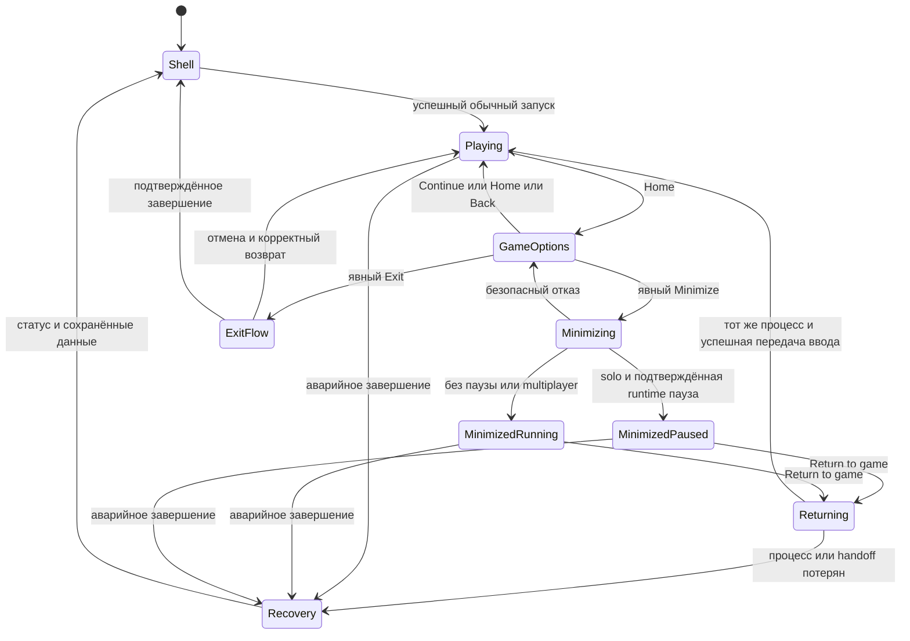

# Карта управления и игровых сессий TrainerOS

**UX-02 · 9 октября 2026 · согласованный продуктовый контракт и план реализации.**
Основание: [#167](https://github.com/EriArk/TrainerOS/issues/167) и дочерние #168–173,
поправки #25/#112/#134/#157, поставленные [коллекции](SERIES_COLLECTIONS.md).
Этот документ фиксирует поведение до изменения кода. Options — рабочее название.
Сначала завершаем карту и документацию; реализация начинается отдельным продолжением
владельца. После UX-02 возвращаемся к MP-02, сохраняя его незакоммиченные timer-правки.

Требования issues считаются принятыми. Предложенная ниже композиция панелей и
внутренние имена интерфейсов — проектное решение для реализации, а не уже
установленный UI или обещание конкретного API эмулятора. Порядок работ задаёт
[ROADMAP](ROADMAP.md); полный реестр новых требований — [#161–173](EXPANSION_161_173.md).

## 1. Основные поверхности

| Поверхность | Для чего | Вход и выход | Контекст |
| --- | --- | --- | --- |
| Home | Выбрать недавнюю игру и запустить её | Primary; Y открывает общие Recent games | Выбранный Adventure, не обязательно запущенный |
| Collections | Просмотр всех игр, серий, ручных и автоматических коллекций | Primary; B из списка возвращает в коллекции | Выбранная коллекция и выделенный объект |
| Companions / Trainer / Social | Существующие предметные функции | Существующие primaries и faces | Их контроллеры и возможности адаптеров/provider |
| Shell Options | Общение, уведомления и общая текущая активность | Home/Guide поверх любого shell-раздела; Home закрывает всю панель, B сначала вложенный уровень | Общие call/party/notification/live-session данные; исходная страница — только фон/точка возврата |
| Context actions | Дополнительные действия выделенного объекта | Select или его видимый эквивалент «…»; B/Select закрывает | Зафиксированный объект и Trainer |
| Game Options | Управление реально идущей игровой сессией | Физический Home в игре; Continue/Home/B возвращает к игре | Неизменяемая идентичность живой сессии |
| Start | Устройство и система | Start внутри shell; B закрывает | Settings, радио, громкость/яркость, питание, системные режимы, Switch Trainer |
| Passive toast | Краткое уведомление без переключения управления | Событие; исчезает по таймеру | Исходное событие provider, без подтверждения действия |

Остаются пять primaries: **Home / Collections / Companions / Trainer / Social**.
Options не становится шестой вкладкой. Pokémon открывает список игр без региональных
миров. All games включает игры из коллекций; личная коллекция не переносит файлы.
Home имеет один выбор по всей библиотеке, Y выбирает из общих недавних игр без запуска.
L2/R2 на Home не меняет коллекцию. В Collections сохраняется переключение коллекций;
в остальных разделах — существующих faces. Повторный вход в Collections открывает grid,
а закрытие overlay возвращает точный прежний вложенный маршрут.

## 2. Кнопки и приоритет ввода

| Кнопка | Обычный shell | Открытый Options или контекст | Игра в фокусе |
| --- | --- | --- | --- |
| A | Главное действие; готовая игра запускается сразу | Выбранное действие | Принадлежит игре |
| B | Назад по текущему маршруту | Назад во вложенном экране, затем закрыть; никогда не Exit | Принадлежит игре |
| Select | Контекст выделенного объекта/экрана | Повторный Select закрывает context picker; не подтверждает опасное действие | Принадлежит игре |
| Home/Guide | Открыть универсальный Shell Options | Закрыть Options к исходному контексту; из локального picker открыть Options с сохранением исходного контекста, без стека двух меню | Открыть Game Options по проверенному platform route |
| Start | Системная панель | В shell открывает только системную панель; закрытие возвращает к Options | Принадлежит игре; системный Start глобально не перехватывается |
| X/Y | Существующие явные shortcuts: Social X compose / Y Together, Home Y Recent games, библиотека Search/Filter | Только подписанные локальные действия текущей поверхности | Принадлежат игре |
| L1/R1, L2/R2 | Primaries / faces с существующими ограничениями | Не меняют скрытую страницу; навигация внутри панели — D-pad | Принадлежат игре |

Текстовый ввод сохраняет собственную грамматику: Select может означать Apply/Send
в открытой клавиатуре. Это не вызов контекста скрытой страницы. Критическая операция
записи/восстановления имеет приоритет над меню; Home не прерывает commit. Подтверждения,
клавиатура и вложенные панели получают ввод раньше фоновой страницы. Новая входящая
активность не открывает интерактивную модаль сама поверх критической операции.

В shell одновременно интерактивен один верхний слой. При переходе Options → Start
сохраняется стек возврата; нельзя нажать действие сквозь оба окна. В Game Options
обычные кнопки принадлежат overlay, но не вызывают shell Start. При каждом переходе
владельца ввода требуется отпускание кнопок и нейтраль стиков/триггеров; удержанное
A не активирует новый экран. Touch и контроллер вызывают один dispatcher.

У существующего Hold A остаётся роль совместимого shortcut к тому же игровому
контексту, без второго набора операций. Видимые «…», Back/Close и Options позволяют
обойтись без чтения геймпадных обозначений. TV-пульт использует фокусируемые входы,
D-pad/Confirm/Back; Home interception зависит от контракта host, не от наличия CEC.

## 3. Композиция Options и Game Options

Панели занимают **85–95% безопасной области экрана**, оставляя узнаваемый приглушённый
фон. Большая площадь отводится содержимому, а не большим кнопкам. Сохраняются тёплая
палитра, материал корпуса, золотистый фокус, компактные иконки и читабельный текст.
Ниже — схема содержания, а не утверждённый пиксельный макет.

| Зона | Shell Options | Game Options |
| --- | --- | --- |
| Заголовок | Options, текущий Trainer, Close | Игра/платформа, состояние сессии, Close |
| Основная левая область | Живая игра с Return to game, если есть; текущая party и звонок отдельными блоками | Обложка или корректный кадр этой сессии, Continue, Minimize, Play Together и поддержанные настройки |
| Основная правая область | Единый inbox: сообщения, вызовы, приглашения, пропущенные события | Тот же inbox и актуальные звонок/party; переход к полному ответу через явный Minimize |
| Постоянные входы | Messages / Friends ведут в существующий Social | Краткие поддержанные действия над звонком/приглашением |
| Опасное действие | Exit игры отсутствует среди случайных общих shortcuts; открыть её Game Options | Exit game пространственно отделён от Continue и обычных действий |

В Shell Options нет Properties выделенной игры, фильтров, управления коллекцией,
настроек устройства и второго чата. Набор возможностей одинаков из всех shell-страниц;
он изменяется только от общей активности и доступности сервисов. Не создаём пустые
панели будущих провайдеров. Пустой inbox показывает спокойное пустое состояние;
offline показывает реальный кэш/статус, без фиктивного «онлайн».

Первый фокус Game Options — Continue. В Shell Options — сохранённый действующий
action ID; при первом входе Return to game, если доступен, иначе Messages.
Обновление списка не передвигает фокус на Exit/Delete/Release. Если выбранный запрос
исчез, остаётся понятное «больше недоступно» до следующего движения/закрытия.
Изображение отсутствующей обложки заменяется нейтральной заглушкой правильной игры.

Handheld использует две компактные области, при ограниченной ширине — последовательные
секции с сохранением иерархии. TV использует отдельные размеры текста, расстояния,
safe area и меньше одновременно видимых строк. Реальная перекомпоновка этих новых
поверхностей — узкая зависимость #156–158 внутри UX-02; полный редизайн всех TV-страниц
остаётся TV-01. Скриншот растянутого handheld не закрывает TV-приёмку.

## 4. Карта контекстных действий

| Фокус | Select / «…» | Идентичность при подтверждении |
| --- | --- | --- |
| Игра на Home | Play Together, Properties, доступное управление игрой | Trainer + выбранный Adventure + revision/content |
| Игра внутри Collections | Тот же игровой контекст; добавить/убрать ручное membership через Collections | Выделенная игра, не карточка коллекции и не игра на Home |
| Личная коллекция | Edit: название, игры/правила; отдельное Delete collection | ID личной коллекции и владелец; ROM и saves не удаляются |
| Встроенная коллекция / фон grid | New collection, поддержанные filter/sort действия; нет Delete встроенной серии | Collection/system ID либо сам library root |
| Social: человек или разговор | Profile, Together/Invite, действия группы и provider permissions | Provider account + user/conversation/group ID |
| Social: сообщение | Существующие допустимые message actions | Conversation + message ID, проверка права снова при выполнении |
| Party / Boxes / Guide | Только существующие операции над выбранным существом/ячейкой/записью | Adventure, save revision, стабильная идентичность объекта, read/write gates |
| Trainer / Journey / Hall / RA | Имеющиеся действия профиля/записи, без системного питания | Owner + ID записи; никакой выдуманной операции ради заполнения меню |

Различаем фокус заголовка коллекции и фокус игры. Текущий безусловный
`Select → manageCollection` на странице библиотеки будет заменён этим выбором.
Точное множество операций берётся из существующего контроллера: эта таблица не
добавляет заранее replies/reactions, семантический save-adapter или новый sorter.

Предлагаемый `ContextAction`: стабильный action ID, label/detail, target type/ID,
effective capability, причина временной блокировки и ссылка на существующий handler.
Контекст фиксируется при открытии, затем проверяется при Confirm и завершении async
операции. Старый callback не получает новый объект из текущего focusIndex.

## 5. Живая сессия и сворачивание

Выбранный Adventure, выполняемый процесс и фоновый звонок — разные идентичности.
Сворачивание сохраняет **Trainer + game ID + session ID + PID/start identity +
runtime/profile + party ID**, а также точку возврата в shell. PID без проверки
времени/принадлежности недостаточен. Открытие другой карточки не меняет live target.

Options само не ставит игру на паузу. Minimize сначала проверяет identity, разрешение
runtime и эксклюзивную передачу ввода, затем переводит интерфейс в shell. Если переход
не завершён, остаётся безопасный владелец ввода и объяснение ошибки; нельзя показывать
успешное сворачивание при продолжающемся управлении игрой из Social.

Minimize восстанавливает сохранённый shell-маршрут/фокус, а не принудительно Home.
Видимый статус живой игры и Return доступны без поиска; уведомление может предложить
перейти к своему разговору только явным действием. После browsing Return не стирает
новый shell-контекст: следующее сворачивание возвращает туда же.

При Return повторно проверяется реальный процесс, возвращается окно/вывод, снимается
только установленная нами и подтверждённая пауза, выполняется neutral gate и лишь
потом передаётся ввод игре. Не создаются второй launch, play-session, capture или
ResumePoint. Перезапуск shell сам по себе не даёт права присоединиться к неизвестному
процессу: требуется проверяемое восстановление владения, иначе recovery.

Карточка живой игры в Shell Options имеет Return и вход в её Game Options.
Для второго входа сначала подтверждается передача вывода/управления обратно игровому
overlay; снятие нашей паузы происходит только по подтверждённому runtime-контракту.
Это тот же live target. Exit из этого состояния проходит обычный #49: подготовить
свежий игровой кадр без UI, применить save policy, завершить процесс. Отмена Exit
возвращает к игре; принудительное убийство фонового процесса не заменяет этот путь.

Options и разрешённое сворачивание не завершают гостевую игровую сессию и сами
по себе не отзывают lease. Изоляция временного контента и save сохраняется;
реальное завершение, истечение/отзыв lease и recovery подчиняются #136–143.

| Ситуация | Решение |
| --- | --- |
| Solo, runtime умеет надёжно паузить и возвращаться | Пауза при Minimize с подтверждением; в shell честное Paused |
| Solo, безопасна передача ввода, но нет доказанной паузы | Minimized / still running; видимое предупреждение о продолжающейся игре |
| Netplay или активная игровая party | Продолжать timing/network; никакого общего SIGSTOP или скрытого savestate |
| Нет безопасной изоляции ввода/окон | Minimize недоступен с причиной; Continue и безопасный Exit остаются |
| Выбрана другая игра при живой сессии | Предложить Return или явный Exit текущей; новая игра не стартует автоматически после Exit |
| Выбран тот же реально запущенный Adventure | Return к нему, без повторного запуска |
| Switch Trainer, обновление runtime, изменение занятого save | Сохранить existing live-session запрет; предложить явный выход, без обхода через Minimize |
| Эмулятор завершился в фоне | Убрать Return по реальному завершению, сохранить правильный outcome и исключить призрачную сессию |
| Смена дисплея/контроллера или потеря helper | Revalidate target, нейтраль и восстановление; не завершать игру для починки меню |

Пауза и время видимости учитываются отдельно от play-session lifetime. Заведомо
paused время не выдаётся за активную игру; неизвестное состояние не угадывается.
Изменение схемы учёта времени, если потребуется, получает migration и тесты отдельно
от истории запусков. Это не реализация новых правил отзывов #113 целиком.
Save guards смотрят на живой процесс, даже если shell снова получает навигацию.

Звук игры и звонка управляется раздельно. По умолчанию solo pause использует runtime
поведение; для продолжающейся игры предпочтительно проверенное duck/mute game stream.
Если такого управления нет, честно сохраняется game audio — нельзя глушить весь
системный sink вместе со звонком или обещать ложный mute. Это capability на runtime/device.

## 6. Один Play Together из разных мест

| Откуда | Уже известно | Что остаётся |
| --- | --- | --- |
| Home / карточка игры | Selected game, Trainer | Человек или группа |
| DM / группа | Provider recipient/conversation | Совместимая игра, только если ещё не определена |
| Game Options | Текущая session/game/runtime, возможная party | Выбрать людей; runtime сам определяет поддержку входа в текущую сессию |
| Shell Options при свёрнутой игре | Та же live session/party | Люди или действия существующей party |

Все входы идут через существующие Social → GameParty → RuntimeMultiplayer/Link.
Активная игра, к которой нельзя присоединиться без перезапуска, не получает ложное
«пригласить в эту сессию». Любой необходимый restart/новая партия требует явного
выхода и обычной подготовки. Нет фонового перезапуска ради Invite.
Selected game и live session задаются различными полями; список с другой игрой
не перенаправляет уже открытое приглашение. Получатель, capacity, exact runtime/content,
consent, expiry, Join/Ask/Rejoin и nearby/online разрешаются прежними сервисами.
Групповой звонок продолжает работать независимо от партии и игры.

## 7. Уведомления и чистые снимки

Один поток событий имеет две поверхности: пассивный toast и интерактивный inbox.
Общая запись содержит provider/account/event/request ID, источник, статус/expiry,
privacy-safe preview и допустимые действия. Исходный provider владеет unread,
acknowledgement и разрешением операции; presentation владеет очередью/длительностью.

Toast поверх игры не принимает фокус, не захватывает устройство ввода, не изменяет
размер окна и не вызывает pause. Home открывает Game Options для ответа. Если passive
overlay не доказан на этом compositor/runtime, событие остаётся в inbox и может быть
показано после возврата. Интерактивный overlay нельзя притворно использовать как toast.

Приоритет: звонок/срочный запрос, затем обычные сообщения и подтверждённые достижения;
серии событий объединяются/ограничиваются. DND, per-conversation mute, скрытые previews,
звук и reduced motion соблюдаются в обоих режимах. Пропавший toast не помечает сообщение
прочитанным, не удаляет missed request и не принимает приглашение. RA #25 сохраняет
проверку новой награды и dedup; исторические награды не воспроизводятся заново.

Перед #49 capture необходим барьер для **всех** наших видимых слоёв: Game Options,
passive toasts и прочих HUD. Capture принадлежит свежему exit token/живой игре;
после него возобновляется допустимая очередь. При невозможности чистого кадра действует
существующий отказ/отмена capture, а не сохранение снимка панели как gameplay.
Точно так же скрытые previews не должны утекать в снимки/историю и неподтверждённые
lock/display-контексты. Системные уведомления добавляются только от реального provider.

## 8. Что уже есть и что менять в коде

| Ответственность | Проверенная отправная точка | Необходимое изменение |
| --- | --- | --- |
| Shell navigation и действия | `ShellController`, `Main.qml`, `HomeMenuCard.qml`; компактные Home/Friends/Chats/Notifications и новые Collections | Общая Options presentation, ContextAction resolver, точный modal/focus return |
| Жизненный цикл | `AdventureLaunchController`, `SessionState`, wiring в `Main.cpp`; active game скрывает shell и блокирует его dispatch | Разделить gameAlive, foreground/input owner и runtime pause; разрешить безопасное browsing без снятия save/owner gates |
| Игровая панель и выход | `AdventureExitPresentation`, `AdventureExitController`, `AdventureExitWindow.qml`; Continue/Exit плюс реальные extra actions | Большая Game Options и новые actions; сохранить единственный #49 exit controller |
| Окна и устройства | `AdventureOverlayService`, `packaging/integrations/adventure-overlay.py`, `overlay_support.py` | Подтверждённый minimize/return handoff, recovery/нейтраль; отдельный passive HUD и capture barrier |
| Приглашения | `SocialController`, `GameParty`, `RuntimeMultiplayer`, существующие Link services | Общий invocation context с selected/live различием; никаких вторых party/transport |
| Изображения/настройки | Library artwork, live preview, `RetroArchAppearance` и existing adapters | Привязка к live game, current/next-launch, реальные capabilities |
| Уведомления | Social notification IDs/requests, `achievementToast`, shell toast | Общая presentation queue и два view; сохранить provider ownership |
| История/пауза | `PlayHistoryController` и launch/exit записи | Одна сессия на process; честные интервалы паузы/фона, без ложного завершения |
| Handheld/TV | Текущий material theme; полная TV-система ещё целевая | Узкий reusable profile/reflow для новых поверхностей, затем общая TV-01 приёмка |

Новые названия границ описывают обязанности, а не предписывают новый глобальный
framework или базу данных. QML отображает модели/вызывает контроллеры; не пишет
save/config, не запускает shell-команды и не владеет токенами Fluxer.
Временное состояние minimized-сессии не является долговременной записью «можно
восстановить игру после перезагрузки». Данные коллекций и существующая navigation
миграция сохраняются; добавление полей не меняет stable Adventure ID.

## 9. Зависимости и порядок поставки

| Этап | Целый пользовательский результат | Обязательные зависимости и выход |
| --- | --- | --- |
| UX-02A · #168/#169 | Из любого shell-раздела открываются одинаковые Options; Select относится к выбранному объекту | Реальные provider hooks, shared target/action модель, touch и controller, exact Back/focus, новый Collections контракт; компоновка Handheld/TV этих поверхностей |
| UX-02B · #170/#171 | Игрок открывает Game Options, сворачивает поддержанную игру, отвечает в Social и возвращается в тот же процесс | A; lifecycle/input ownership, capability-профили, безопасные pause/audio, #49 capture/Exit, обе handheld поставки |
| UX-02C · #172/#173 + #25/#134 | Invite доступен из всех заявленных мест; сообщения/вызовы/награды имеют общий inbox и безопасные игровые toasts | A/B; exact selected/live binding, фактический compositor route, privacy/DND/dedup, отказ без поломки игры |
| UX-02D · #167/#135/#157 | Полный сквозной сценарий и согласованная инструкция управления | Результаты A–C; реальные Flip/Odin, профили/TV acceptance; каждый оставшийся внешний gate записан отдельно |

Этапы — зависимые результаты, а не квота «один тест/одна кнопка за ход». Каждый
объявленный этап включает реализацию, UI, интеграцию, необходимые проверки,
поставку на оба доступных handheld и commit/push. A может проектировать compositor
контракт для B, но не заявляет рабочее сворачивание. D не заменяет функциональность
повторной проверкой давно пройденных тестов.

D — завершение интеграции A–C и остаточной приёмки, а не отдельный обязательный
test-only ход. Приёмочные проверки входят в соответствующие функциональные этапы;
повторяются лишь затронутые общей интеграцией сценарии.

Следующая реализация — UX-02A **после отдельного продолжения владельца**. Затем B–D,
после доступной реализации UX-02 — возврат к прежней oldest-first MP-02…MP-07 очереди.
Непроверенный внешний TV/аудио/сетевой gate не превращается в бесконечную серию
одинаковых тестов и не закрывается текстом. Сам parent остаётся открыт по такому gate.
Новые DS #162–166 уточняют MP-06; #161 готовится перед alpha publication. Они не
становятся параллельной текущей реализацией и не возвращают Pack Studio перед альфой.

## 10. Приёмочная карта

| Проверка | Условие успеха | Доказательство |
| --- | --- | --- |
| Options со всех пяти primaries и faces | Один global model; точный Back/Home return, без смены скрытой страницы | Controller + pointer, исходные route/ID/focus, screenshots |
| Select | Home game, library game/header, Social person/message, Companions target, Trainer record | Разные target types; stale owner/content/request отклоняются |
| Большая панель | 85–95% safe area, компактные действия, читаемые игровые/социальные данные | Handheld и настоящий reflow TV; owner visual acceptance отдельно |
| Solo minimize | Живой PID/start identity/session тот же после Social и Return; подтверждённая pause либо честное still running | Минимум один реальный solo runtime, повторные циклы на Flip/Odin |
| Multiplayer minimize | Игровой обмен, party и групповой звонок остаются; ввод shell не управляет игрой | Минимум один уже поддержанный paired route, реальные независимые действия; human audio gate отдельно |
| Другой Adventure / Switch Trainer / save-write | Никакого второго процесса, чужого owner или записи занятого save | Отказ/явный Exit; отмена сохраняет игру |
| Invite из каждого входа | Одинаковые GameParty permissions; известные game/recipient не выбираются снова | Home, Collections, DM/group, live и minimized session; async смена контекста |
| Toast и inbox | В игре не теряется ввод; события доступны в обоих Options, expiry/dedup/DND реальны | Сообщение, вызов, invite, verified RA, burst, offline и unsupported overlay |
| Exit | Только явный Exit, свежий чистый кадр без наших UI, прежняя save policy | Cancel/capture failure/graceful close/crash; минимум solo и multiplayer маршруты |
| Recovery | Потеря helper/UI/controller/display не создаёт phantom Return/Ready | Нарушение каждого перехода, process exit в фоне и recovery identity |

Для каждого runtime/device ведётся отдельная строка возможностей: interactive
overlay, minimize/return, pause, background input isolation, audio control и
passive toasts. На старте все **новые** возможности отмечаются «не проверено».
RetroArch, PPSSPP, Dolphin, melonDS и ARMSX2 нельзя сертифицировать друг через друга.
Поддержка двух игроков не доказывает четыре; один роутер не доказывает разные сети.
Демонстрационные screens/mock tests не заменяют живой процесс, gameplay и TV.

## 11. Решения до включения конкретного runtime

Нужны ограниченные проверки реализации, а не новые продуктовые согласования:
подтверждение foreground/input handoff на фактическом compositor; безопасный
runtime pause/resume API; раздельное управление игровым звуком; метод no-focus HUD;
поведение при helper/UI crash и перезапуске shell; измеримый учёт paused intervals.
Если метод не подтверждён, соответствующая capability остаётся недоступной с причиной.
Проверки выбираются для заявленного маршрута, без исследования каждой игры в ROM-диске.

Рабочее название Options и точные пропорции внутренних панелей можно уточнить на
предметном визуальном просмотре. Это не изменяет роли кнопок, session ownership,
порядок Exit или разрешения на данные. Остальной полный TV/UI редизайн не считается
неявно завершённым вместе с этими панелями.
