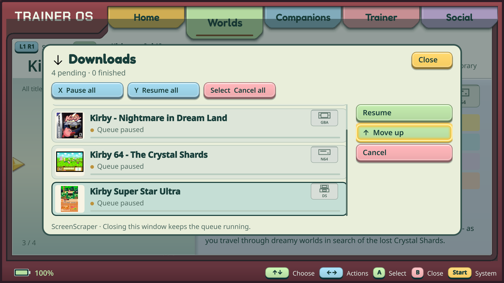
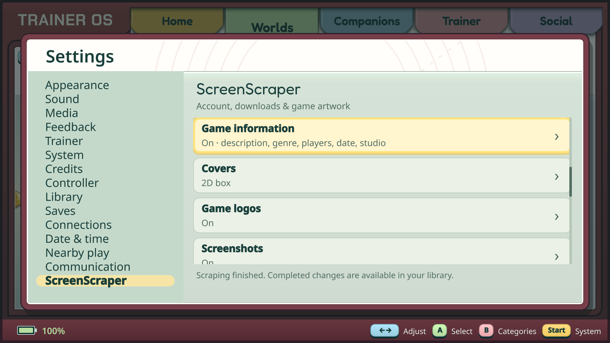
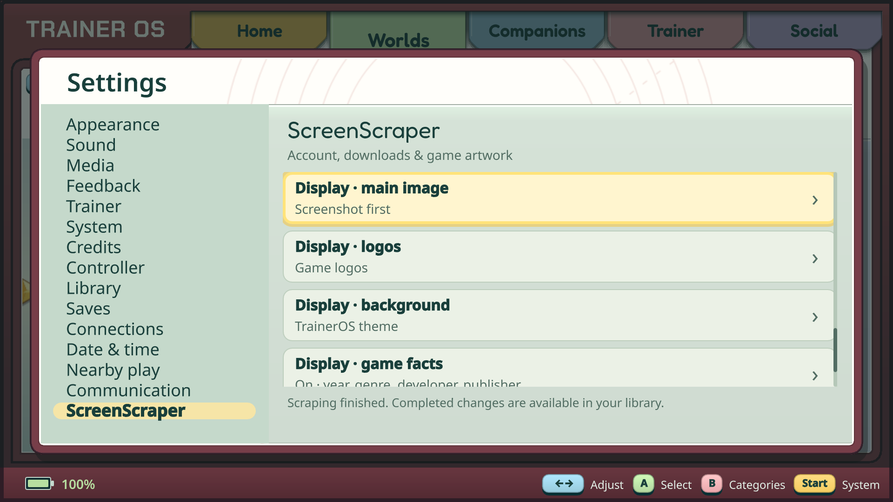
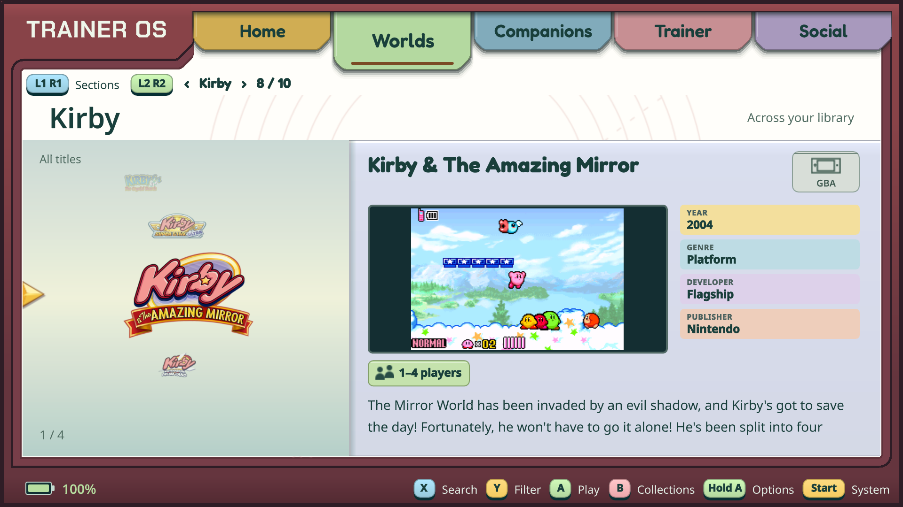
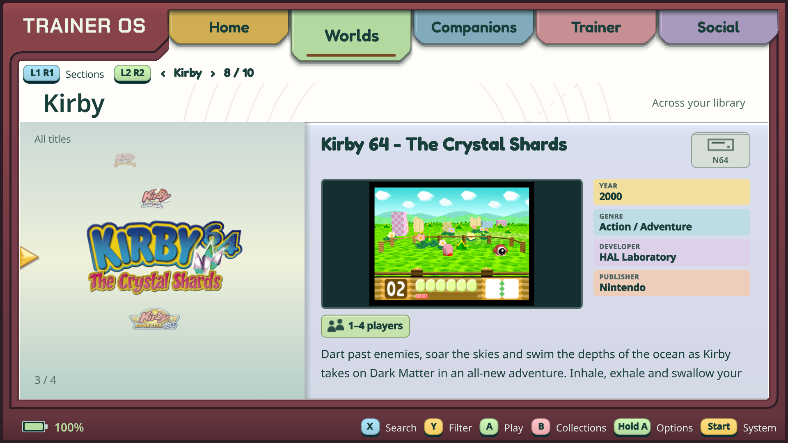

# Downloads, ScreenScraper and the game library — 8 October 2026

Five unedited 1920×1080 captures from the Retroid Pocket Flip 2 running the
installed native TrainerOS build from `9deec20`. Published at the owner's request.
These are device screenshots, not mockups. Account fields are outside the captured
Settings viewport; no login, password or authenticated service URL is shown.

## Downloads

The shared window opens from Start quick controls. Game thumbnails and platform
badges accompany the queue, with pause/resume, ordering and cancellation actions.
This capture shows an intentionally paused ScreenScraper queue. The capture job
was cancelled afterward.

## ScreenScraper settings

Download preferences and library display preferences are independent.

| What to download | What to display |
| --- | --- |
|  |  |

## Games after scraping

Two installed games after the missing-fields ScreenScraper pass. Existing local
media is preserved where already present; these captures do not imply every
visible image was newly downloaded. The previews are library media, not live
emulator sessions.

| Kirby & The Amazing Mirror — GBA | Kirby 64: The Crystal Shards — Nintendo 64 |
| --- | --- |
|  |  |

Game media and trademarks remain with their respective rights holders; these UI
screenshots do not include ROMs or relicense the depicted artwork. See
[licensing boundaries](../../LICENSING.md) and
[implemented behavior and verification](../../docs/SCREENSCRAPER.md).
