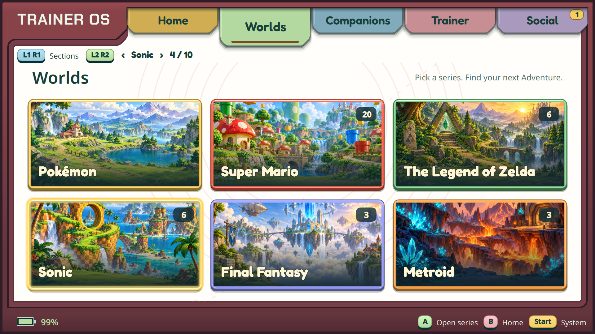
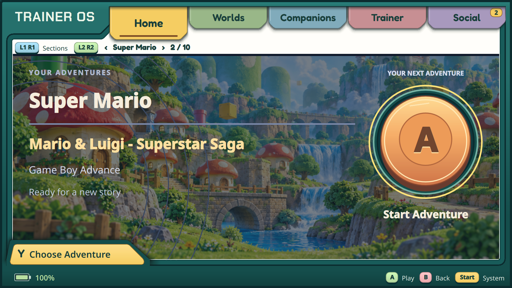

# Series collections — 4 October 2026

Unedited 1920×1080 captures from the actual Retroid Pocket Flip2 and AYN Odin 2
displays. Both run the ARM64 binary recorded in
[delivery evidence](../../docs/SERIES_COLLECTIONS.md). These are installed UI,
not generated mockups. Only the illustrated environments inside collection cards
were generated; their source records live in `assets/series/generation.json`.

| Capture | Device / content |
| --- | --- |
| [Collections](collections-flip.png) | Flip: first six cards with its existing library |
| [More series](collections-lower-flip.png) | Flip: controller scrolling, Castlevania/Kirby/Metal Slug |
| [Multiverse](multiverse-flip.png) | Flip: remaining unclassified games |
| [Collections](collections-odin.png) | Odin: populated new series |
| [Mario Home](home-odin.png) | Odin: series Home with generated fallback scenery |
| [Zelda Home](home-zelda-odin.png) | Odin: L2/R2 cycling to another independent choice |
| [Choose Adventure](choose-odin.png) | Odin: Y only offers games in the current series |

Collection counts reflect private installed libraries at capture time, not
bundled/distributed ROMs. This increment provides library/Home/launch for the new
series; it does not claim their semantic save adapters or companion features.

