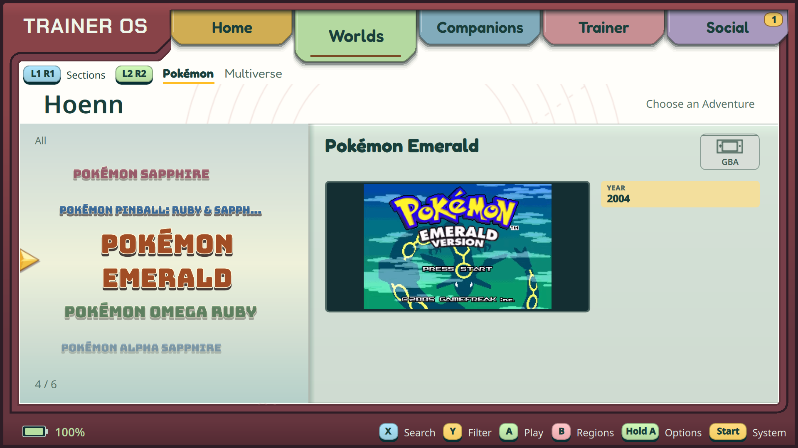
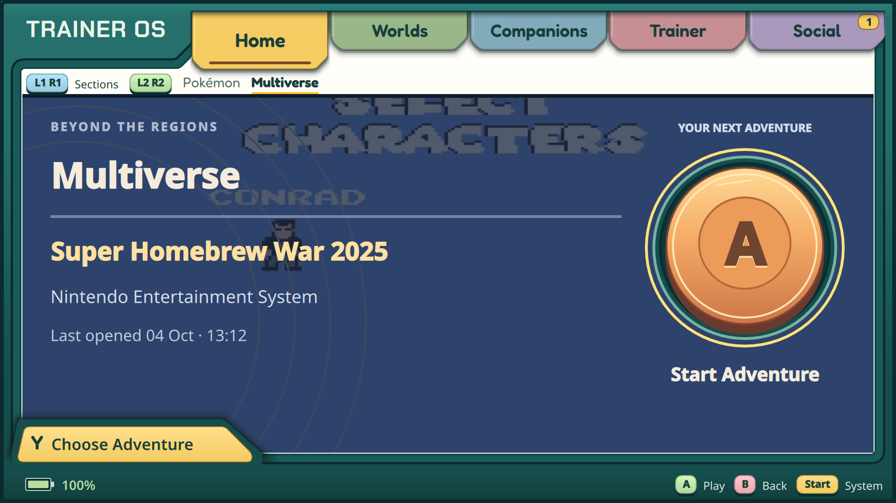
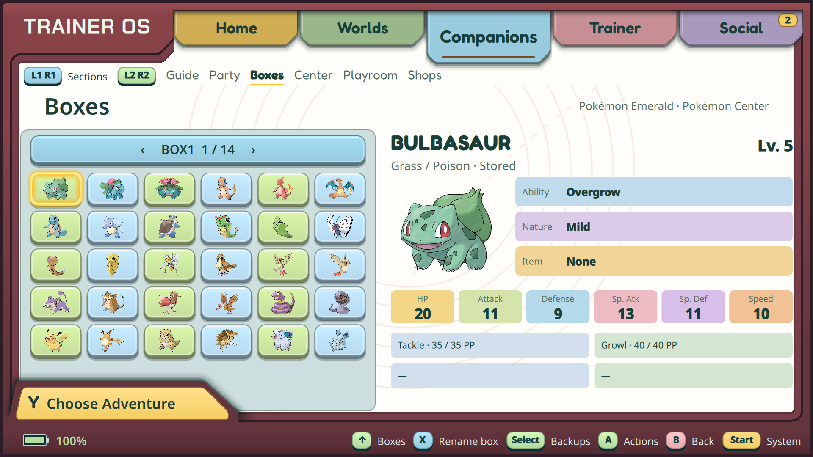

# TrainerOS — website screenshot selection

Captured on **4 October 2026** from the installed TrainerOS application on
Retroid Pocket Flip 2 and AYN Odin 2. Original **1920 × 1080 PNGs**, with no
compositing or image retouching. Turquoise shell: Odin; red shell: Flip.
Adventure progress comes from the existing test saves on those devices.

For the website's opening section, start with **01 Home**, **06 Field Guide**,
**09 Care Center** and **10 Playroom**. The library pair **04–05** shows the
broader system browser and its game wheel. Files can be downloaded directly;
click any preview for the full-resolution original.

## Home and library

| Home · Odin | Worlds · Flip |
| --- | --- |
|  |  |

| Adventure wheel · Flip | Multiverse · Flip |
| --- | --- |
|  |  |

| Game library and preview · Flip | Multiverse Home · Odin |
| --- | --- |
|  |  |

## Companions and progression

| Field Guide | Party |
| --- | --- |
|  |  |

| Boxes | Care Center |
| --- | --- |
|  |  |

| Playroom | Shops |
| --- | --- |
|  |  |

| Journey |
| --- |
|  |

## System controls

| Start menu | Settings |
| --- | --- |
|  |  |

## Capture record

Both devices were running executable SHA-256
`e6a1cac1e2b62a43ab85f4ea299cca916b598824f067dbf04c3d39f29bdb78aa`.
These are presentation captures of installed behavior, not acceptance evidence
for the handheld-link work in progress. The devices' private game and art
libraries appear in the interface; this folder contains screenshots only.

Earlier diagnostic captures remain [in the parent folder](../README.md).
